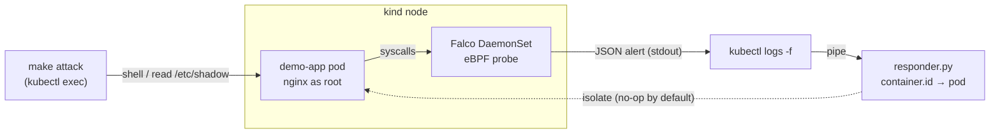

# Kubernetes Runtime Security Lab

A self-contained **detect-and-respond loop** for Kubernetes: [Falco](https://falco.org) — the CNCF-graduated runtime-security engine — detects threats at the syscall level via eBPF, and a standard-library-only Python responder automatically isolates the offending pod. Runs locally on [kind](https://kind.sigs.k8s.io) in three commands. No cloud account, no Helm, no cost.

<!--  -->

## Overview

- **Deploy** — Falco 0.40.0 as a DaemonSet (one agent per node, modern eBPF engine) plus a deliberately misconfigured demo app (`nginx` running as root with privilege escalation allowed).
- **Detect** — two custom Falco rules fire on a shell spawned inside a container and on reads of sensitive files such as `/etc/shadow`.
- **Respond** — [`responder.py`](responder.py) parses Falco's JSON alert stream and isolates the pod behind any high-priority alert. The response is a **safe no-op print by default**.

## Architecture



<details><summary>Plain-text version</summary>

```
  make attack                     Kubernetes node
  (trigger an event)         ------------------------
        |                    |  [ demo-app pod ]      |
        +------------------> |        ^               |
                             |        | syscalls      |
                             |  [ Falco DaemonSet / eBPF ]
                             ------------------------
                                      |  JSON alert (stdout)
                                      v
                              kubectl logs --> responder.py --> isolates the pod
```
</details>

Falco watches the kernel through eBPF, matches activity against its rules, and prints a JSON alert tagged with the **container ID**. The responder reads that stream, resolves the container ID to a Kubernetes **pod** with `kubectl`, and isolates any pod tied to a high-priority alert. The same lookup doubles as a noise filter, since non-Kubernetes containers (e.g. Docker Desktop's own) resolve to no pod and are ignored — see [Design note](#design-note-deterministic-over-convenient).

## Prerequisites

| Requirement | Notes |
|---|---|
| **Docker Desktop** | Allocate at least **4 CPU / 8 GB RAM** (*Settings → Resources*). Falco's eBPF probe needs a recent kernel; Docker Desktop's Linux VM provides one. |
| **kind** | `brew install kind` |
| **kubectl** | `brew install kubectl` (often already installed) |
| **Python 3** | Any 3.x; ships with macOS. The responder uses the standard library only. |

## Quickstart

**One terminal** — a single command runs the attack and shows detections + response inline:

```bash
make up        # create the kind cluster + deploy Falco (DaemonSet) + demo app
make demo      # trigger the threats and print detections + response
make down      # tear it all down
```

**Two terminals** — watch the loop react in real time:

```bash
make respond   # terminal 1: stream alerts into the auto-responder (blocks until Ctrl-C)
make attack    # terminal 2: simulate the threats
```

> Start `make respond` in its own terminal *first* — it streams and does not return. Then trigger `make attack` from a second terminal.

`make up` takes a couple of minutes on the first run (it pulls the Falco image), then actively probes until the eBPF probe is capturing before reporting ready. `make demo` (or `make attack` with `make respond` watching) prints:

```
[ALERT] Warning: Shell Opened In Container  (pod=demo-app-7c9d… ns=default)
    [RESPONSE] would isolate pod=demo-app-7c9d… ns=default
[ALERT] Warning: Sensitive File Read In Container  (pod=demo-app-7c9d… ns=default)
    [RESPONSE] would isolate pod=demo-app-7c9d… ns=default
```

> The response is a **safe no-op print by default**. To make it real, uncomment the `kubectl delete` line in [`responder.py`](responder.py)'s `isolate()` function. A deny-all `NetworkPolicy` is a gentler alternative to deletion.

### Make targets

| Target | What it does |
|---|---|
| `make help` | List all targets with descriptions |
| `make up` | Create the kind cluster, deploy Falco + the demo app, wait until the probe is capturing |
| `make attack` | Trigger both detections (benign, local sandbox only) |
| `make demo` | One-shot: stream alerts through the responder while running the attack (~20 s) |
| `make logs` | Stream raw Falco JSON alerts |
| `make respond` | Stream detections into the auto-responder (blocking) |
| `make down` | Delete the kind cluster and everything in it |

## Detection rules

Both rules are `WARNING` priority and live in the ConfigMap in [`falco.yaml`](falco.yaml). The ruleset is self-contained — it defines its own macros and loads *only* these two rules instead of Falco's ~100 defaults, so the demo is not buried in unrelated alerts. Both carry MITRE ATT&CK tags.

| Rule | Fires when | Triggered by |
|---|---|---|
| **Shell Opened In Container** | a shell (`sh`, `bash`, `zsh`, …) is spawned in any container | `kubectl exec … -- sh` |
| **Sensitive File Read In Container** | a process reads `/etc/shadow` or `/etc/sudoers` | `cat /etc/shadow` |

The target is a deliberately misconfigured workload ([`app.yaml`](app.yaml)): nginx running as root with privilege escalation allowed. The image is benign — the misconfiguration is the point.

## The responder

[`responder.py`](responder.py) is ~90 lines of standard-library Python:

1. Reads Falco's JSON alerts from stdin (non-JSON startup logs are skipped).
2. Extracts `container.id` from the alert and resolves it to a `(namespace, pod)` pair via `kubectl get pods -A -o json` (cached per container).
3. Alerts whose container maps to no pod — host processes, Docker Desktop's internal containers — are ignored.
4. For priorities `Emergency` / `Alert` / `Critical` / `Error` / `Warning`, it "isolates" the pod: a no-op print by default, with a one-line commented `kubectl delete` to arm it.

### Design note: deterministic over convenient

Falco offers a tidy `k8s.pod.name` field, but on kind its CRI-based enrichment is **asynchronous and unreliable** — measured at roughly 2 of 21 alerts carrying a pod name, and forcing synchronous enrichment collapsed event throughput to zero. The `container.id` field, by contrast, is derived synchronously from the cgroup and is **always present**.

So the responder builds on the deterministic signal: it resolves `container.id → pod` itself via `kubectl get pods`, with a per-container cache. This made the loop dependable, eliminated the CRI socket mount and `container_engines` config entirely, and filters non-Kubernetes noise for free. The full investigation is in [DEBUGGING.md](DEBUGGING.md) (entries 3–7).

## Repository layout

```
k8s-runtime-security-lab/
├── falco.yaml      # Namespace + ServiceAccount + custom rules (ConfigMap) + DaemonSet
├── app.yaml        # the misconfigured demo workload
├── responder.py    # reads Falco alerts -> isolates the pod (stdlib only)
├── attack.sh       # benign commands that trigger the detections
├── Makefile        # help / up / attack / demo / logs / respond / down
├── DEBUGGING.md    # symptom -> diagnosis -> fix log from building the lab
└── README.md
```

## Troubleshooting

Getting Falco running cleanly on Apple Silicon surfaced **ten distinct failures** — probe/kernel mismatch, read-only-config crashes, unreliable pod enrichment, eBPF probe-attach timing. Each is documented symptom → diagnosis → fix in **[DEBUGGING.md](DEBUGGING.md)**. Common issues:

- **Falco pod is `CrashLoopBackOff` with `Error: Initialization issues during scap_init`.** The eBPF probe can't initialize — almost always an old-Falco / newer-kernel mismatch (Falco 0.38 hit this on Apple Silicon's 6.12 kernel). This lab pins **Falco 0.40.0**, which loads cleanly on current Docker Desktop; if a future kernel breaks it, bump the image tag in `falco.yaml` to the latest Falco. Switching `engine.kind` to the legacy `ebpf` driver is *not* a reliable fallback — it needs kernel headers Docker Desktop's VM does not ship.
- **`make up` hangs on "Waiting for Falco…".** The DaemonSet pod isn't becoming Ready — inspect it with `kubectl describe -n falco pod -l app=falco` and `kubectl logs -n falco -l app=falco`. Usually the driver issue above, or insufficient Docker resources (give Docker Desktop 4 CPU / 8 GB).
- **`make demo` printed no alerts.** Falco's stdout can take a few seconds to surface in `kubectl logs`. `make demo` waits for this, but on a slow flush just run it again. The live `make respond` + `make attack` flow streams continuously and does not have this lag.
- **`make logs` shows shells you didn't run.** Falco watches the whole node through the shared kernel, so it also sees Docker Desktop's own containers (e.g. a recurring `wget` health probe). That is realistic noise — `make respond` / `make demo` filter it, because the responder only acts on alerts whose container resolves to a real Kubernetes pod.
- **`kind: command not found`.** `brew install kind`, and make sure Docker Desktop is running.
- **Cluster already exists.** Run `make down` first, or `kind delete cluster --name runtime-lab`.

## Extending the lab

- Add a GitHub Actions + Trivy scan to block bad images/config before deploy (shift-left).
- Send alerts to Slack or a webhook from the responder instead of printing.
- Replace the pod delete with a deny-all `NetworkPolicy` for a less destructive "isolate".
- Add an LLM step that summarizes each alert and maps it to MITRE ATT&CK (the rules are already tagged).

---

> **Safety:** Defensive learning lab. The "attack" script only triggers detections inside the throwaway local cluster; it contains no exploit code and touches nothing outside the sandbox.