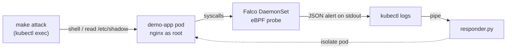

# Kubernetes Runtime Security Lab

A tiny, self-contained lab that **detects runtime threats in a Kubernetes cluster and responds to them automatically** — using [Falco](https://falco.org) (eBPF), the same open-source engine behind commercial CNAPP tools.

It runs locally in a few commands. No cloud account, no Helm, no cost.

<!--  -->

## What it does

- **Deploys** Falco as a DaemonSet (one agent per node) and a deliberately misconfigured demo app (nginx running as root, privilege escalation allowed).
- **Detects** runtime threats: a shell opened inside a container, or a read of a sensitive file like `/etc/shadow`.
- **Responds** automatically: a small Python script reads Falco's JSON alerts and isolates the offending pod.

## Architecture



<details><summary>Plain-text version</summary>

```
  make attack                     Kubernetes node
  (trigger an event)         ------------------------
        |                    |  [ demo-app pod ]      |
        +------------------> |        ^               |
                             |        | syscalls      |
                             |  [ Falco DaemonSet / eBPF ]
                             ------------------------
                                      |  JSON alert (stdout)
                                      v
                              kubectl logs --> responder.py --> isolates the pod
```
</details>

Falco watches the kernel through eBPF, matches activity against its rules, and prints a JSON alert tagged with the **container ID**. `responder.py` reads that stream, maps the container ID to a Kubernetes **pod** with `kubectl`, and isolates any pod tied to a high-priority alert — which also filters out noise from non-Kubernetes containers, since they map to no pod. (Resolving the pod client-side is more reliable than Falco's built-in pod-name enrichment, which is asynchronous and flaky on kind — see *What I learned*.)

## Prerequisites

- **Docker Desktop** — give it enough room: *Settings → Resources → at least 4 CPU / 8 GB RAM*. Falco's eBPF probe needs a recent kernel; Docker Desktop's Linux VM provides one.
- **kind**, **kubectl**, **Python 3**:
  ```bash
  brew install kind kubectl        # kubectl may already be installed
  python3 --version                # ships with macOS / any 3.x is fine
  ```

## Quickstart

**Simplest path** — one command does the attack and shows the response inline:

```bash
make up        # create the kind cluster + deploy Falco (DaemonSet) + demo app
make demo      # trigger the threat and print detections + response
make down      # tear it all down
```

**Live version** — watch it react in real time, using two terminals:

```bash
make respond   # terminal 1: watches alerts and the automated response (blocks/streams)
make attack    # terminal 2: simulate a threat
```

> Run `make respond` in its own terminal *first* — it streams and won't return until you stop it (Ctrl-C). Then trigger `make attack` from a second terminal.

`make up` takes a couple of minutes the first time (it pulls the Falco image). `make demo` (or `make attack` with `make respond` watching) prints something like:

```
[ALERT] Warning: Shell Opened In Container  (pod=demo-app-7c9d… ns=default)
    [RESPONSE] would isolate pod=demo-app-7c9d… ns=default
[ALERT] Warning: Sensitive File Read In Container  (pod=demo-app-7c9d… ns=default)
    [RESPONSE] would isolate pod=demo-app-7c9d… ns=default
```

> The response is a **safe no-op print by default**. To make it really delete the pod, uncomment the `import subprocess` and the `kubectl delete` line in [`responder.py`](responder.py).

## Files

```
k8s-runtime-security-lab/
├── falco.yaml      # Namespace + ServiceAccount + custom rules (ConfigMap) + DaemonSet
├── app.yaml        # the misconfigured demo workload
├── responder.py    # reads Falco alerts -> isolates the pod (stdlib only)
├── attack.sh       # benign commands that trigger the detections
├── Makefile        # up / demo / attack / logs / respond / down
└── README.md
```

## The two detection rules

Both are WARNING priority and live in the ConfigMap in [`falco.yaml`](falco.yaml):

| Rule | Fires when | Triggered by |
|------|-----------|--------------|
| **Shell Opened In Container** | a shell (`sh`, `bash`, …) is spawned in any container | `kubectl exec … -- sh` |
| **Sensitive File Read In Container** | a process reads `/etc/shadow` or `/etc/sudoers` | `cat /etc/shadow` |

## Troubleshooting

- **Falco pod is `CrashLoopBackOff` with `Error: Initialization issues during scap_init`.** The eBPF probe can't initialize — almost always an old-Falco / newer-kernel mismatch (Falco 0.38 hit this on Apple Silicon's 6.12 kernel). This lab pins **Falco 0.40.0**, which loads cleanly on current Docker Desktop; if a future kernel breaks it, bump the image tag in `falco.yaml` to the latest Falco. (Switching `engine.kind` to `ebpf` is *not* a reliable fallback here — the legacy driver needs kernel headers Docker Desktop's VM doesn't ship.)
- **`make up` hangs on "Waiting for Falco…".** The DaemonSet pod isn't becoming Ready — inspect it: `kubectl describe -n falco pod -l app=falco` and `kubectl logs -n falco -l app=falco`. Usually the driver issue above, or not enough Docker resources (give Docker Desktop 4 CPU / 8 GB).
- **`make demo` printed no alerts.** Falco block-buffers its stdout, so a detection can take a few seconds to surface in `kubectl logs`. `make demo` waits for this, but if you catch a slow flush just run it again. (The live `make respond` + `make attack` flow streams, so it doesn't have this lag.)
- **`make logs` shows shells you didn't run.** Falco watches the whole node through the shared kernel, so it also sees Docker Desktop's own containers (e.g. a recurring `wget` health-probe). That's realistic noise — `make respond` / `make demo` filter it, since the responder only acts on alerts whose container maps to a real Kubernetes pod.
- **`kind: command not found`.** `brew install kind`, and make sure Docker Desktop is running.
- **Cluster already exists.** Run `make down` first, or `kind delete cluster --name runtime-lab`.

## Going further

- Add a GitHub Actions + Trivy scan to block bad images/config before deploy (shift-left).
- Send alerts to Slack or a webhook from the responder instead of printing.
- Replace the pod delete with a deny-all `NetworkPolicy` for a less destructive "isolate".
- Add an LLM step that summarizes each alert and maps it to MITRE ATT&CK (the rules are already tagged).

## Debugging log

Getting this to run end-to-end on Apple Silicon took real work — Falco/kernel version mismatches, unreliable pod enrichment, and eBPF probe timing. The full play-by-play (symptom → diagnosis → fix) is in **[DEBUGGING.md](DEBUGGING.md)**.

## What I learned

> Two Falco rules and a small stdlib responder make a complete **detect-and-respond loop**. eBPF sees every process `exec` and file `open` at the syscall level. The lesson that cost the most time: Falco's *pod-name* enrichment is asynchronous and unreliable on kind, but the **container ID** is always present — so the responder resolves the pod itself with `kubectl`. Prefer the deterministic signal over the convenient one.

---

> **Safety:** Defensive learning lab. The "attack" script only triggers detections inside the throwaway local cluster; it contains no exploit code and touches nothing outside the sandbox.
